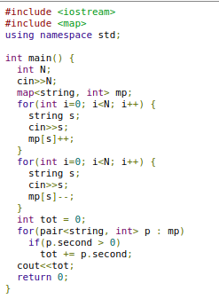
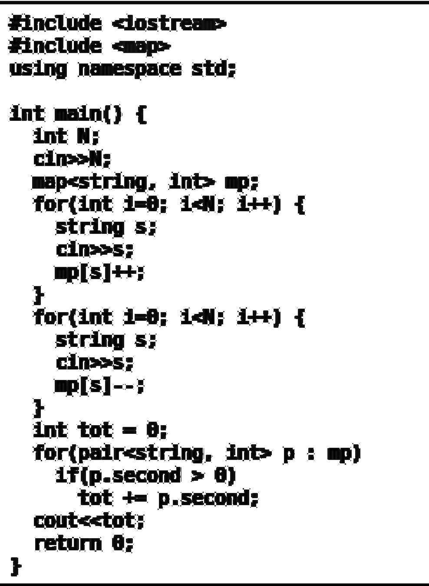
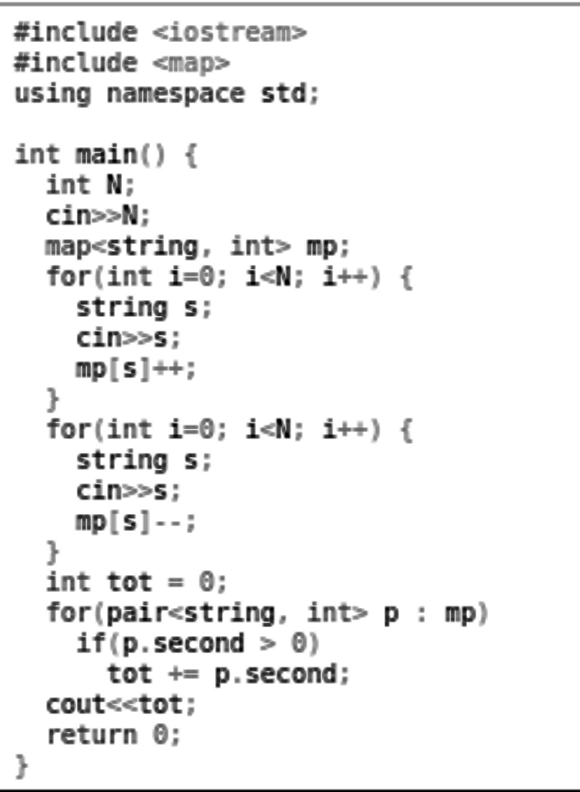

Projeto Final - Processamento de Imagem

Nome: Samuel Ferreira Guimarães Santos - 9293498

Descrição do Problema

O objetivo do projeto é transformar uma imagem que contém um programa em código usando OCR (Optical Character Recognition), que é uma tecnologia para reconhecer caracteres a partir de um arquivo de imagem. Os códigos serão obtidos do site www.codeforces.com, onde ocorrem competições no estilo maratona de programação. 	Nessas competições, uma parte da pontuação é obtida criando casos de teste para "quebrar" a solução de outros participantes. Se o caso criado, "quebrar" a solução do adversário, é concedida uma pontuação; caso contrário, o competidor que enviou o caso, perde pontos. A plataforma permite acesso ao código dos outros competidores no formato de imagem, por isso, testar o caso localmente demanda muito tempo, pois é necessário copiar o código inteiro. O projeto seria utilizado para acelerar esse processo, pois seria possível testar o caso localmente com um tempo consideravelmente menor.

Solução

Para a implementação do projeto foi utilizado a biblioteca Tesseract, da Google, de OCR e a biblioteca OpenCv par Python.
Primeiro passo, do projeto foi capturar uma imagem e fazer o reconhecimento do texto, usando o Tesseract.

| Código | Texto Reconhecido |
|-------------|--------------|
||Texto reconhecido: mam: Gunman mum: «at» uslng namsvate 5m; m lam” ( m (111))” markstnnq. m) In; mom rB' 14:; m) (   mm; 5;  Ms!» ) mom ; smug s; wlsl - 14:: m) ( )   m m  fuflnalkstnny. 1n!) .. : up) ”u. mun-1 ) aw m K n.5unnd; (“mm  return |

 Como pode ser observado, os resultados iniciais foram ruins. Para melhorar os resultados, foram utilizadas algumas técnicas aprendidas em aula, a fim de processar a imagem. 
	Como as cores da sintaxe não fazem diferença no código, a imagem foi convertida para escala de cinza. Depois disso, a primeira técnica de realce implementada foi a de equalização de histogramas, porém o resultado não foi satisfatório.
	
| Código | Texto Reconhecido |
|-------------|--------------|
||Texto reconhecido:  finctuda dust“ fincmle up: . . using namespaue std: int: “in“ { int: ll: aim-:11: lap-astring.1nt=- In: fnr{1liti1-D.1¢ll: 14+] { string 5:- film-s: } illl‘lis‘lH: forflnté 1-D: 1d]: 14+! { string SF: aim-s: } natal-:4 int; tut - D: forwair-astdm int:- p 1:. qr] 1flp.second\ =- I) hit +- p. salami: flout-«tut: rah]m' D: } |

Após isso, foi utilizado a função fastNlMeansDenoising do OpenCv para remover os ruídos das imagens utilizando uma média não local. Como pode ser observado abaixo, os poucos caractereces da imagem são realmente reconhecidos.

| Código | Texto Reconhecido |
|-------------|--------------|
||“mum. dusxmn “mm. «In. mm nllrslalne m: in: mm) ( m: u: um: npsnnm. m: In: mum in 14:; 1+.) ( ) lama. mum in 14:; 1+.) ( ) m: m . hull-Insulin. up u I.» "(p.nmm > )|

Depois de alguns testes e pesquisas de transformações, foi possível obter um resultado mais próximo do código esperado, usando as seguintes operações:
  - Aumentar o tamanho da imagem, utilizando a função resize da biblioteca openCV, utlizando a interpolação cúbica
  - Remoção de ruídos para suavizar a imagem
  - Transformação morfológica de erosão.
  
| Código | Texto Reconhecido |
|-------------|--------------|
||#include <iostream> #include <map> using namespace std; int main() { int N; cin>>N: nap<string. int> mp: for(int i=0; i<N; i++) { string 5; cin>>s: mp[s]++; } for(int i=0; i<N; i++) { string 5; cin>>s: mp[s]--; } int tot = 0; for(pair<string. int> p : mp) if(p.second > 0) tot += p.second: cout<<tot; return 0: |

Resultados

Com o processamento das imagens, foi possível obter um resultado muito próximo do esperado. O programa ainda erra alguns caracteres, por exemplo, troca de s por 5, de vírgula por ponto-vírgula, de 0 por 6, são os principais erros. Mas na maioria dos casos, funciona muito bem, foi calculado cerca de 95% de acerto dos caracteres.
No futuro, esses casos que possuem maior incidência de erros, poderiam ser tratados separadamente para diminuir a quantidade  de erros, além de estudar outras métodos para pré-processar a imagem antes de rodar o Tesseract
